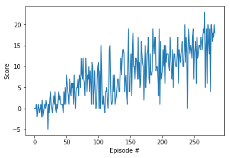

## 1. Description of the implementation
The solution is based on the Deep Q-Learning algorithm provided in the course.
The main difference is on the Q Network, that was modified with some dropout layers.

These layers usually work very well with Deep Learning Networks. They remove information
and makes the network more robust.

 In this case, it improved the number of episodes needed for training, but I think
 the final network has very broad results. The average score is 13, but there are
 apisodes with score 25 and score 0.

 With the provided network, the training usually requires longer (more episodes), but the resulting agent seems to be more stable.

 ## 2. Learning algorithm
There are no differences with the basic Q-Learning algorith. The only modification
are the Dropout layers.

 My guess was that the information received by the agent is very visual. Although It was not bitmap data, My guess was that the Dropout layer would help.

 The idea was also to reuse this network in the Pixels scenario, but I did not tested
 it in this scenario.

 The initial idea was testing a basic Q-learning algorithm as provided and see how it
 was going.

After playing with the number of layers and number of units on each layer, I could
not improve the learning rate.

I was playing with large value of epsilon decay (0.995-0.9995). Then I noticed that
this was a limiting number for the model, It was taking too many random decisions at some point. This is good for some scenarios, but in this case seemed that it was playing too much. So I decided the use a lower epsilon decay and after some tuning I got a number (0.975) that required few cycles of training and actually learned.

 ## 3. Plot of rewards
The average score plot, reveals that the agent has a good learning rate, and reaches the 13 average score quite fast:

In this case it achieved the 13 average score in 183 episodes.

## 4.Ideas for Future Work
At least the recommended alternative algorithms (Double DQN, Dueling DQN and Rainbow DQN).
In the case of this implementation, I has a lot variance in the results. Using a slower learning rate  got an algorithm that had less variance (there was not much difference among max and minimum episode scores).
Watching the agent, I could notice that it sometimes gets stuck, and that in that episode it gets few points.
Maybe adding a larger first layer (to acomodate for the fact that the provided status space has very different data) or reduce the dropout rate or just increase epsilon to allow a more stable learn.
