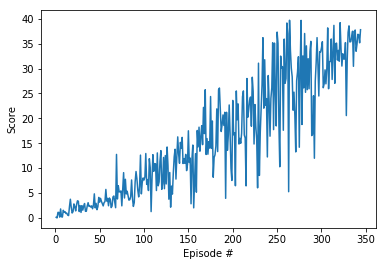

## 1. Description of the implementation
The solution is based on the ddpg-bipedal code provided in the [github repository](https://github.com/udacity/deep-reinforcement-learning/tree/master/ddpg-bipedal). The main difference is that, instead of using the OUNoise class, I have added some dropout layers to the actor and critic networks. I did not have time to compare each other, but it seems to work in a similar way.

These layers usually work very well with Deep Learning Networks. They remove information and makes the network more robust.

 In this case, I could not get the network to converge using the OUNoise generator, but adding the dropout layers, the network converged faster than just the network without them.

 ## 2. Learning algorithm
The learning algorithm used in this practice is the DDPG algorithm. This algorithm uses an Actor network to estimate the best action given the current state. This estimate is fed to a Critic network that calculates the expected value obtained by the action.
After the action is applied to the environment, the obtained reward is used to train the Critic network and in turn the predicted value obtained by the critic is used to train the actor to better predict its outcomes.

DDPG algorithm uses 2 pairs of netwoks: 2 local actor and critic networks (that are updated through training often) and 2 target actor and critic networks that are used for evaluation that are updated slowly. These networks are blend slowly using a soft update in order to allow the target network to get the changes in the local network in a more stable way.

The used algorithm is implemeted as a version of this basic DDPG algorithm. After playing with the number of layers, I could not make the nework to converge to a solution.

The basic approach includes the addition of some exploratory noise that is used to evaluate action values that may not be predicted by the Actor network.

In my case, I added some Dropout layers that in fact add noise to both Actor and Critic networks, although this addition is not controlled as the OUNoise in the base DDPG algorithm.

In this case this approach worked, since the scenario seems to be simple enough, and the Dropout layer not only add enough noise to serve as exploratory noise, but also allow the noetwork to avoid overfitting.

Anoher problem found, was that I was reusing the max_t parameter that limits the number of steps spent on each episode, to avoid an infinite training loop.

The limit was set to a lower value, specific for the bipedal scenario from the starting code. But it was limiting the maximum score that could be obtained in this scenario.

After changing the parameter to a larger value, it took longer to train, but with higher scores, because in this scenario the score depends on the time that the network can follow the target goal.

 ## 3. Network parameters and hyperparameters
 Both the Actor and Critic networks have 3 layers with 256 and 128 units. Compared with the simpler networks that were used in DQN, in this case the prediction of a continuous value required a larger depth of the network.
 In fact I tried with smaller networks (32 and 16 units) but the network did not converge or converged too slowly.

The hyperparameters of the network are:

    BUFFER_SIZE = int(1e6)  # size of the replay buffer
    BATCH_SIZE = 256        # minibatch size
    GAMMA = 0.99            # discount factor
    TAU = 1e-3              # for soft update of target parameters
    LR_ACTOR = 1e-4         # learning rate of the actor
    LR_CRITIC = 1e-4        # learning rate of the critic
    WEIGHT_DECAY = 0.0      # L2 weight decay

The parameters were tuned through trial and error, trying to minimize the amount of time needed to converge and that the network really converged to a solution.

The BUFFER_SIZE has been tested with 1e3 and 1e4, but it did not converge. The same witha BATCH_SIZE of 128. The learning rates were kept the same, and tried with 1e-3 and 1e-5 but they did not converge or took too long to converge.

 ## 4. Plot of rewards
The average score plot, reveals that the agent has a good learning rate, and reaches the 30 average score quite fast:

In this case it achieved the 13 average score in 344 episodes.

## 5.Ideas for Future Work
At least the recommended alternative algorithms (A3C and GAE).
In the case of this implementation, I would explore the OUNoise module, that could not get working. Also, the limit on max_t may be relaxed and see how could work.
There is another issue that I could not solve. This problem takes a long time to train and converge. Even when testing on the Udacity workspace that uses a GPU or in my local computer that does not use a GPU, the train time is similar and quite long. I am not sure where the problem is, but definitely seems a good point to improve.
