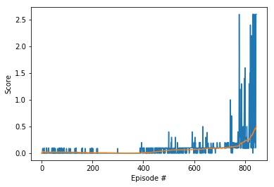

# Project 3: Collaboration and Competition

### Introduction

In this third practice we have to implement an algorithm that learns in a scenario with multiple agents. In this case the difficulty comes from the fact that each agent acts on the same scenario that the others and makes a situation were the learning algorithms do not find a stationary environment and find it hard to converge to a solution.

### Implementation
The implementation is based on the DDPG algorithm used on the previous practice wich in turn was based on the code from [this github repository](https://github.com/udacity/deep-reinforcement-learning/tree/master/ddpg-bipedal). I have also ideas from the "MADDPG - Lab" from the course and from other students, in particular [abhismatrix1](https://github.com/abhismatrix1/Tennis-MultiAgent) and [gtg162y](https://github.com/gtg162y/DRLND/blob/master/P3_Collab_Compete/Tennis_Udacity_Workspace.ipynb).

The main modifications are:

 - Exploratory noise: Instead of using OUNoise module, I have used a normal noise generator, that is atenuated after each episode. After training the agent, I saw that the agent required arroung 400-500 episodes to start converging. During this period, the noise module has to be kept high enough that the agent hits by accident the ball. In this case, some positive outcomes are found by the agent. If during this 400-500 episodes there is not enough exploratory noise, the agent will not converge.

 - Addition of dropout layers: to avoid overfitting with learning data, I have added some dropout layers that help convergence of the agent.

 - Hyperparameters: the main tuning was on the exploratory noise level as explained. Also the number of layers of the Critic and  

### Learning algorithm

In this case I have used a Multi Agent DDPG algorithm, defined in [this paper (lowe2017multi)](https://arxiv.org/pdf/1706.02275.pdf).

This algorithm is a modification of the Deep Deterministic Policy Gradients. DDPG instead of calculating the Q function as the Policy base algorithms, directly determines the outcomes using an Actor network and a Critic to evaluate the Actor outcomes.

In the case of multiple agents, the environment is not stationary, since each agent interacts with the environment and interfering with each other agent.

This makes the multiple scenario harder for DDPG and single agent algorithms hard to converge to a solution.

MADDPG is a modified version of DDPG that works for multiple agents. In this case,
there are multiple DDPG agents (all equal) that share the Replay Buffer. The critic network, instead of using the actions from the agents, uses the actions from all the agents in the environment, thus the facilitating the convergence of the algorithm.

Eeach agent includes the actions from the other agent (but only in Critic network) this facilitates the evaluation from the Critic and the convergence of the algorithm, keeping the Actor separate and using only the state that is viewable by the agent.

### Plot of rewards

The algorith converged in 844 episodes. The convergence was very slow at the beggining
and very fast in the end.
I think that the environment makes the agent behave this way: since it has to hit the ball repeated times, one it learns how to hit the ball, the repetition of the same scenario makes it get a lot of reward very sudden.

### Ideas for Future Work
I have tried using epsilon greed algorithm instead of exploratory noise, but I could not get better results as reported by other students.
In this case, it takes a long time to converge at the beggining, my goal was to try to reduce this time, with no success. I thought that exploratory noise avoided convergence, but reducing the noise also reduced the average of rewards seen by the agents and they do not converge.
Other students have tried adding some episodes were the agent does not learn, just explores, but I did not see any difference (always takes arround 400-500 episodes to start convergence).

Maybe a diffenrent Actor and Critic network (more depth or different layers) make a difference and also implementing a Priority Replay Buffer.

In this way I tried reducing the Replay Buffer, to make the agents forget about old exploratory episodes, but in the case of this scenario it is not useful. Although old exploratory episodes may be discarded, the new ones take longer steps, much longer steps, so in the end limiting the Replay Buffer limits the number of the lengthier episodes that can be stored.
